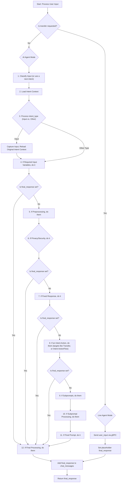

# PinionAI Intent Processing

The intent flow processing of a `user_input` is the central orchestrator for handling user messages within the PinionAI client library. It determines the user's intent, executes various actions (like API calls, data parsing, or security checks), interacts with AI models, and ultimately generates the appropriate response to be displayed to the user.

## Functional Signature

```python
def process_user_input(user_input, sender):
```

- **`user_input`**: The text message provided by the user.
- **`sender`**: The identifier of the sender (e.g., "user"). This is primarily used for live agent `gRPC` communication.

- **Returns**: The final response string generated by the system, intended for display to the user.

## Core Logic Flow

The function's logic is primarily split into two main modes: **AI Agent Mode** (where the AI handles the conversation) and **Live Agent Mode** (where the conversation is transferred to a live human agent via gRPC communication).

### Initialization and Mode Determination

1.  **`final_response` Goal**: The goal is to generate a final response. An empty string `final_response` is initialized to accumulate the response.
2.  **`sender` Update**: `sender_id` is updated with the `sender` parameter, which is relevant if a live agent transfer occurs.
3.  **Mode Check**: The function first checks if a transfer has been requested..
    - If `transfer_requested` is `False` (or empty), the system operates in **AI Agent Mode**.
    - If `transfer_requested` is `True` (or has a value), the system operates in **Live Agent Mode**.

---

### AI Agent Mode (`if not transfer_requested:`)

This is the primary path for AI-driven conversations. The intent processing steps below are roughly executed sequentially, with many steps being conditional on `final_response` not yet being set (meaning no blocking action or response has occurred). While the intent processing steps are sequentially available to the process, certain steps like subprompting can run sequentially, or async depending on your deisreds

#### 1. Classification

- **Next Intent Check**: If `next_intent` is set (indicating a pre-determined follow-up intent from a previous turn), it uses this as the current intent.
- **Dynamic Classification**: Otherwise, it attempts to `classify_input` to determine the user's intent based on the `user_input` and begin's with the agent's `startPrompt`.
- **Failure Handling**: If classification is not within the desired intents that this AI agent will handle, a default response containing what functionality is available, can be returned, for example.

#### 2. Load Intent Context

- Retrieves the full intent configuration (`intent_data`) for the classified intent from the agent's loaded configuraton data.
- Extracts key properties from `intent_data` such as `intent_type`, `privacy_level`, `target_variable`, `fixedResponseMessage`, `deliveryMethod`, `language`, `inputVars`, and various process flows such as intent context flow (`preprocess`, `subprompts`,`subprocess`, ` finalprompt``finalprocess `) or `actionFlow`, etc...

#### 3. Process `intent_type`

- **If `intent_type` is not "input"**:
  - Resets any input variables (`inputVars`) that are configured to be reset for this intent.
  - Stores the original `user_input` in `class_message` and the `intent_data` in `class_intent_data`. This is crucial for multi-turn interactions where an "input" intent might follow.
- **If `intent_type` is "input"**:
  - This indicates the AI is expecting a specific piece of information from the user (e.g., a phone number, an amount).
  - The `user_input` is captured and stored in a `target_variable` as specified by the intent configuration.
  - Special handling for phone numbers (`format_phone`) is applied.
  - **Relooping to Original Intent**: If this "input" intent was a follow-up to a previously classified intent (stored in `class_intent_data`), the function reloads the context of that original intent. This allows the system to continue processing the original intent after receiving the required input or series of inputs.
  - A check is performed to ensure the received input was actually expected by the original intent; if not, a clarifying message is set as `final_response`.

#### 4. Do Required Input Variables

- Iterates through `intent_input_vars` (variables required by the current intent).
- If any required variable is missing from `var`, its corresponding `prompt_msg` is set as `final_response`. This effectively prompts the user for the missing information and halts further processing until all the result inputs are provided. Note that in the variable configruation, it is possible to control whether to always re-ask for an input variable if it already exists, or skip variables that may already exist.

#### 5. Do Preprocessing

- If `final_response` is not yet set, any `intent_preprocess` actions (e.g., API calls, data parsing, custom scripts) defined for the intent are executed.

#### 6. Do Privacy Security Processes

- If `final_response` is not yet set and the `privacy_level` is 'private' or 'highly' (and the user is not yet `authorized`):
  - **Authentication**: If the user is found and enrolled, a blocking authentication process is started based on privacy level. The system then waits for authentication completion.
  - **Enrollment**: If the user is not enrolled, an enrollment process is sent.
  - The outcome of these interactions (success, failure, pending enrollment) is used to set `auth_response_message`, which can become `final_response` if authentication fails or is pending.

#### 7. Do Fixed Responses

- If `final_response` is not yet set and the `intent_type` is "fixed", the `fixedResponseMessage` from the intent configuration is evaluated for variable substitution and set as `final_response`.

#### 8. Do Actions

- If `final_response` is not yet set and the `intent_type` is specified as "action":
  - The system first standardizes the intent's action-related data into a common format.
  - It then checks the `action_type` from this standardized data.
  - **Journey Action**: If `action_type` is "journey", it constructs a payload and sends a request to Journey. `final_response` is set based on the outcome.
  - **Transfer Action**: If `action_type` is "transfer", it calls if transfers are allowed, and if so, sets `transfer_requested` is set (triggering Live Agent Mode on the next turn) and a response message is generated.
  - **Generic Action**: For other `action_type`s, it looks for an `action_flow` (defined in the intent's `actionFlow` property).
    - If an `action_flow` exists, it or a sequence of actions are executed.
    - The `final_response` is then determined in this order of priority:
      1. The `action_response_message` defined in the action, if it exists.
      2. The response returned from the `process_routing` call, if any.

#### Final Processing after Action

- If `final_response` was set by an action, and `intent finalprocess` is defined, these final processes are executed.

#### 9. Do Subprompts

- If `final_response` is not yet set and `intent_subprompt` is defined:
  - `subpromts` are executed and can:
    - Execute multiple subprompts, potentially concurrently if subpromts were combined in a list [].
    - Execute a single prompt, or chain of prompts sequentially.
    - Execute a Multi-Step Process (MCP) server, resource or prompt.
  - The responses from these subprompts are collected and concatenated into a `sub_message` while results of individual responses are saved into respective variables.

#### 10. Do Subprompt Processing

- If `final_response` is not yet set and `intent_subprocess` is defined, these actions listed in intent subprocess step are executed.

#### 11. Do Final Prompt

- If `final_response` is not yet set and `intent_finalprompt` is defined:
  - The system iterates through the configured final prompts/mcp actions.
  - For each item, it can either:
    - Send a prompt to the LLM.
    - Execute a Multi-Step Process (MCP) server.
  - The first valid response from these operations is set as `final_response`.

#### 12. Final Processing (before response)

- If `intent_finalprocess` is defined, these actions are executed. This step runs even if `final_response` was already set by a final prompt or any other processing step. This is the last opportunity to write out data, deliver results or other actions before the response is given back to the user.

---

### Live Agent Mode (`else: # Live agent transfer requested`)

This path is taken when `transfer_requested` is `True`, indicating that the conversation has been handed over to a human agent.

- **Send gRPC Message**: If the gRPC client stub is connected, the `user_input` is sent directly to the live agent.
- **Placeholder Response**: `final_response` is set to a placeholder message like "Message sent to live agent. Waiting for reply...". The actual agent's response will be received asynchronously by the gRPC listener thread and added to `self.chat_messages`.
- **Error Handling**: If the gRPC client is not connected despite a transfer being requested, an error message is set as `final_response`.

---

### Updating Chat History and Return

1.  **Add to History**: If a `final_response` (from either AI Agent Mode or Live Agent Mode) has been generated, it is appended to `chat_messages` with the "assistant" role.
2.  **Return**: The `final_response` string is returned to the user.

---

## Key Internal Variables and Their Roles

- **`var`**: A dictionary holding all dynamic variables and configuration values for the current session. It's constantly updated throughout the processing flow.
- **`final_response`**: The string that will ultimately be returned to the calling application for display. Its value is built up conditionally through the various processing steps.
- **`next_intent`**: Used to pre-set the next intent to be processed, enabling multi-turn conversations or specific follow-up questions without re-classification.
- **`transfer_requested`**: A flag that, when set, switches the function's behavior to communicate with a live agent via gRPC.
- **`privacy_level`**: Indicates the sensitivity of the current intent, influencing whether security checks are performed.
- **`target_variable`**: Stores an input into `variable` or is a variable used in a defined action.
- **`class_intent_data` / `class_message`**: These store the context of a previously classified intent and its original user input, allowing the system to "remember" the context when an "input" intent is used as a follow-up.
- **`process_routing`**: A crucial internal processor that executes a processing steps. It can handle various types of actions (APIs, Parsers, Mergers, Scripts, Rules, Deliveries, nested Actions, MCPs, File Operations) and can also set the `next_intent` for a defined intent following turn.

## Intent Flow Diagram (Conceptual)



This detailed breakdown should provide a comprehensive understanding of how `intent processing` orchestrates the conversation flow within the PinionAI client.
